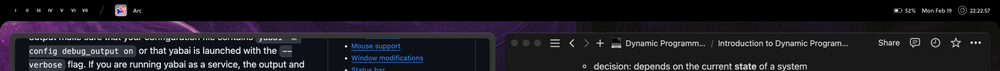

# 

wunderbar is a status bar replacement for macOS, written in rust and using
native cocoa bindings. wunderbar will support workspace switching (with yabai
integration prioritized!), integrations with music players/spotify, dynamically
rendered icons for battery, wifi, etc, and more. wunderbar is heavily inspired
by [Sketchybar](https://github.com/FelixKratz/SketchyBar)!

> [!WARNING]
> i am hard at work developing wunderbar as quickly as possible, but it is still
> alpha software that is probably not ready for daily use so be careful!!!

# how does it look?

while wunderbar is intended to be flexible enough to create any look desired, i
am prioritizing any features that will allow me to achieve this concept look i
designed a couple months ago on sketch:

# todos

- [ ] safe `gui` module based on cocoa bindings
- [ ] customizable bar background shape with options for position, corner
      radius, etc
- [ ] basic layout system for adding items to the bar
- [ ] support for workspaces
- [ ] clock/wifi/battery support
- [ ] dynamic icons for clock/wifi/battery
